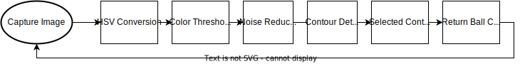

# Byggern' - TTK4155 Embedded and Industrial Computer Systems Design Project

## Structure

├── docs  
├── LICENSE.meta  
├── node1  
├── node2  
├── node3  
│     ├── can_forwarder  
│     ├── test_data  
│     ├── tracking  
└── README.md  

### Summary
The 3 nodes communicate over a CAN bus. Node 1 is an Atmega162, Node 2 is an ATSAM3X8, Node 3 is an Arduino Uno connected over serial to a computer running OpenCV. Node 3 is an extra node which is not part of the curriculum.

## Visual Feedback with OpenCV

As an extra node to our system we implemented a ball tracker for visual feedback. This allowed us to implement a basic auto-tracking state based on the estimated ball position. The ball tracking is based on finding the contour of a color mapped image and filtering for maximum circularity.

<video width="650" height="650" src="https://github.com/tordnat/Byggern_Embedded_Systems_Project/assets/48350530/e62d85df-395b-401e-ba83-1f78afaf9b08"></video>

The third node uses OpenCV to detect the position of the ball which is forwarded to node 2. 

