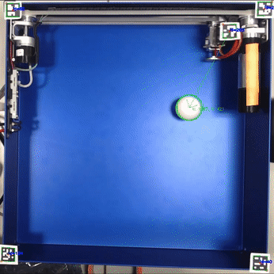

# Byggern' - TTK4155 Embedded and Industrial Computer Systems Design Project

## Structure

├── docs  
├── LICENSE.meta  
├── node1  
├── node2  
├── node3  
│     ├── can_forwarder  
│     ├── test_data  
│     ├── tracking  
└── README.md  

### Summary
The 3 nodes communicate over a CAN bus. Node 1 is an Atmega162, Node 2 is an ATSAM3X8, Node 3 is an Arduino Uno connected over serial to a computer running OpenCV. Node 3 is an extra node which is not part of the curriculum.

## Visual Feedback with OpenCV

<video width="650" height="650" src="https://github.com/tordnat/Byggern_Embedded_Systems_Project/assets/48350530/39bdcba3-e350-430a-a784-dbd0d7d79c5d
"></video>

The third node uses OpenCV to detect the position of the ball which is forwarded to node 2. 

